# 🎯 LOGOS.AI: Agentic AI Debate Coach & Presentation Analytics Platform

[](https://fastapi.tiangolo.com)
[](https://nextjs.org)
[](https://www.python.org)
[](https://react.dev)
[](https://opensource.org/licenses/MIT)

**LOGOS.AI** is an advanced, production-grade **Agentic AI Debate Coach & Presentation Analytics Platform**. Engineered for learners, debate coaches, educators, and institutions, it empowers users to master high-stakes rhetoric, argument structure, public speaking prosody, and logical fallacy defense in real-time.

---

## 📸 Platform UI & Output Screenshots

### 1. Landing Page & Feature Overview
> Modern cyber-editorial aesthetic featuring the 8-module suite, scoring matrix, and AI personas.

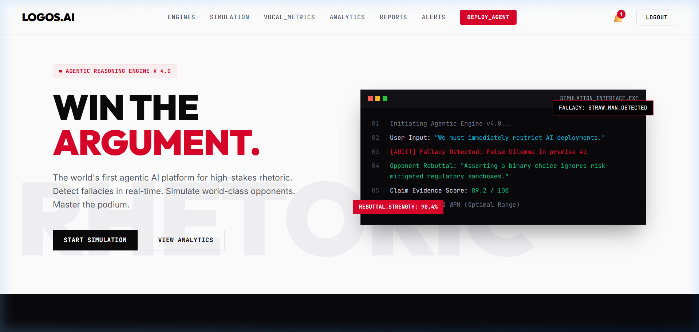

---

### 2. Analysis Suite & Personas
> 8 core modules: Argument Mining, Logic Audit, Rebuttal Gen, Vocal Metrics, Simulation Engine, Weighted Scoring, Coaching Engine, and Analytics Dashboards.

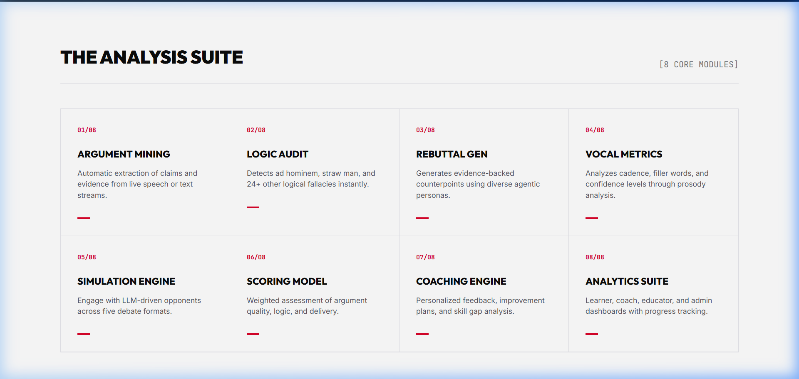
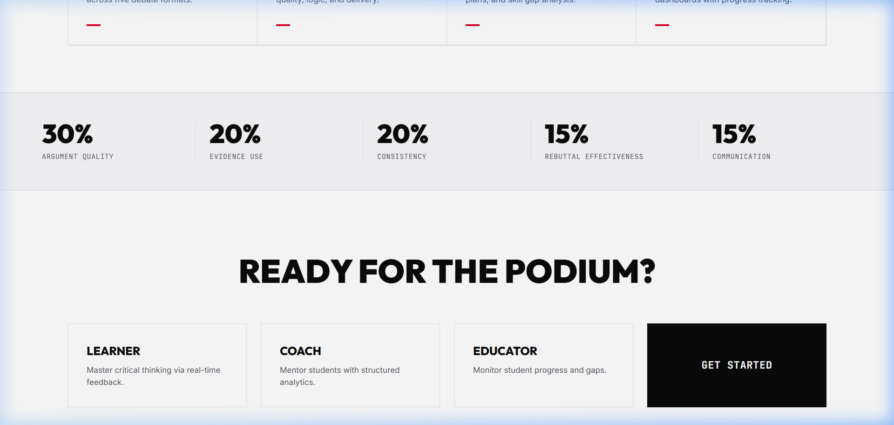

---

### 3. Authentication Flow
> JWT-secured authentication with role-based access control (Learner, Debate Coach, Educator, Administrator) and brute-force lockout protection.

| Sign Up (`/signup`) | Login (`/login`) |
|:---:|:---:|
| 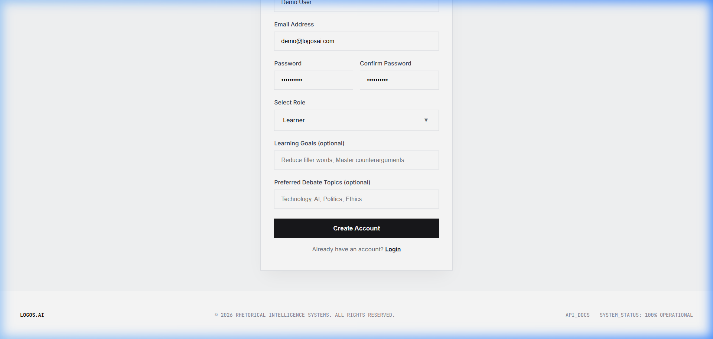 | 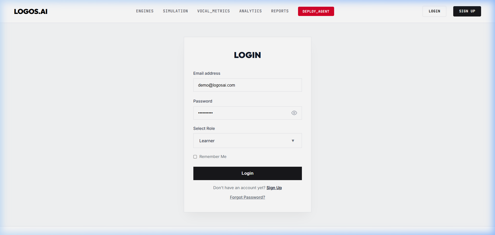 |

---

### 4. Interactive Dashboards & Session Management
> Real-time performance telemetry, session creation, baseline metrics, and history.

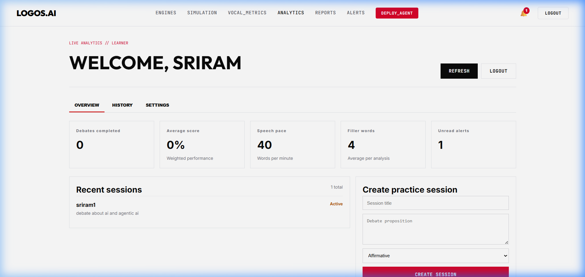
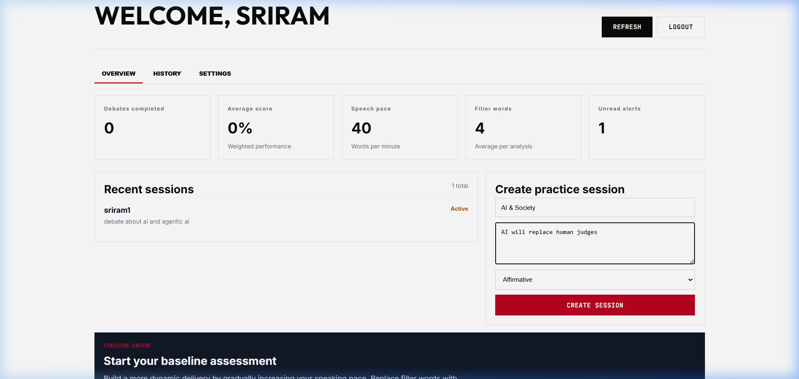

---

### 5. Live AI Debate Simulation Terminal (`/simulation`)
> Multi-turn debate with real-time AI personas (*The Contrarian*, *The Academic*, *The Strategist*), live fallacy detection, rebuttal scoring, and automated coaching tips.

| Simulation Configuration | Live Debate Terminal (Output) |
|:---:|:---:|
| 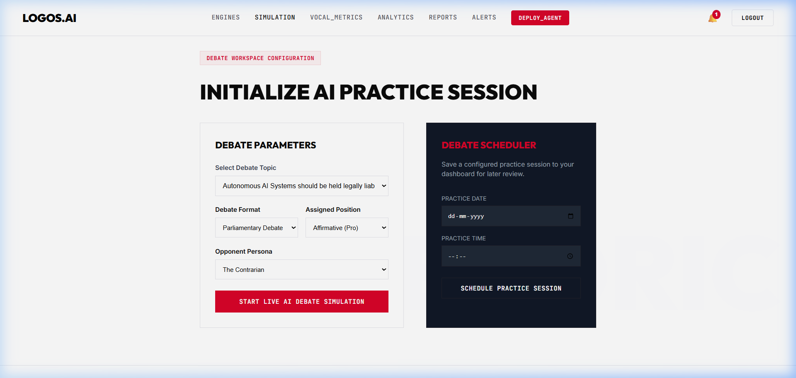 | 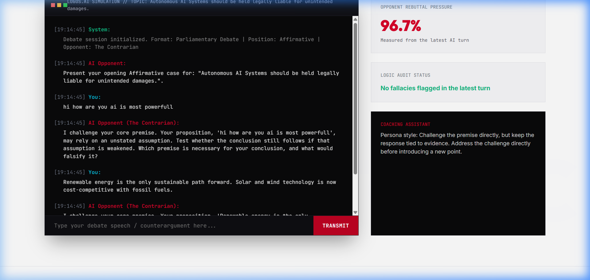 |

---

### 6. Vocal Metrics & Prosody Analysis (`/presentation`)
> Detailed speech evaluation computing Words Per Minute (WPM), filler-word density, confidence score, clarity, and engagement from audio files or transcripts.

| Audio / Transcript Submission | Analytical Output Metrics |
|:---:|:---:|
| 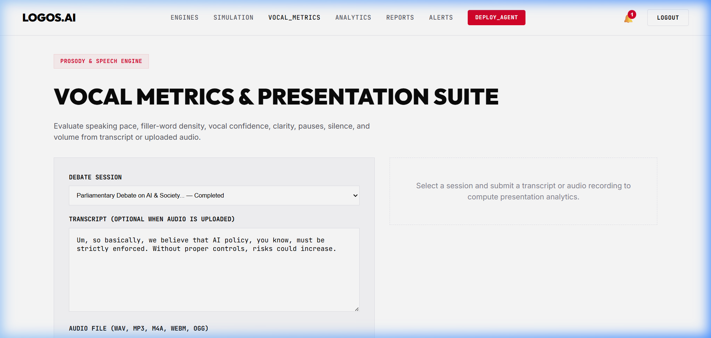 | 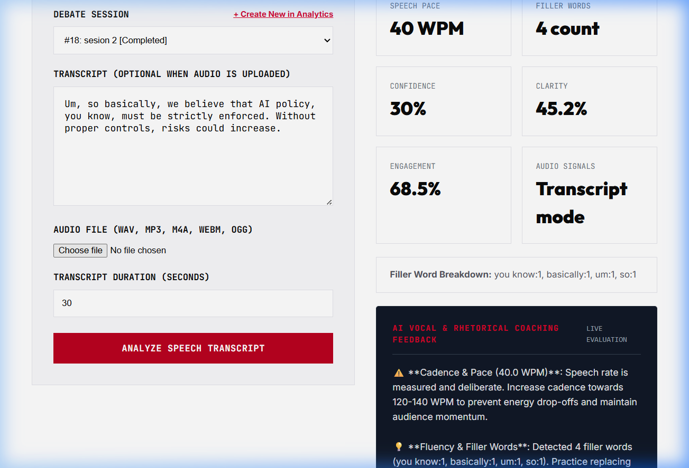 |

---

### 7. Exportable Reports & Verifiable Certificates (`/reports`)
> Downloadable assessment PDFs, 5-dimension Excel workbooks, personalized coaching plans, and verifiable credential verification.

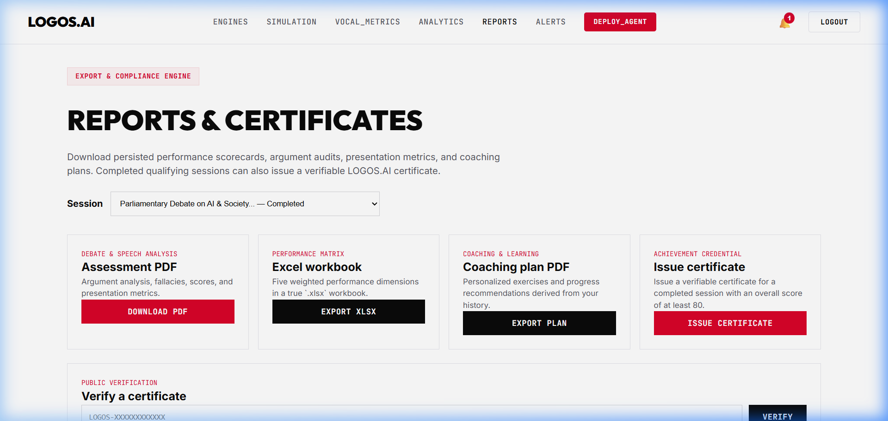

---

### 8. Realtime Alerts & System Notifications (`/notifications`)
> Categorized notifications for milestones, coaching feedback, and scheduled sessions.

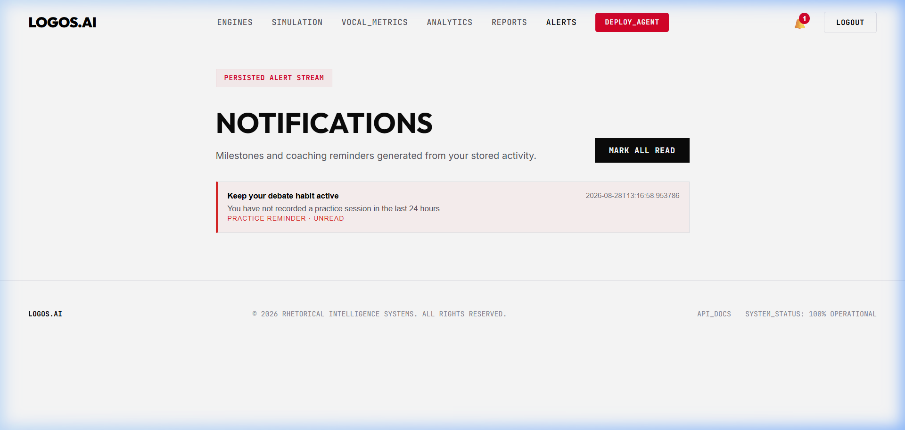

---

### 9. Interactive API Documentation (`localhost:8000/docs`)
> 14 fully-featured Swagger REST API router endpoints with OpenAPI 3.0 schema definitions.

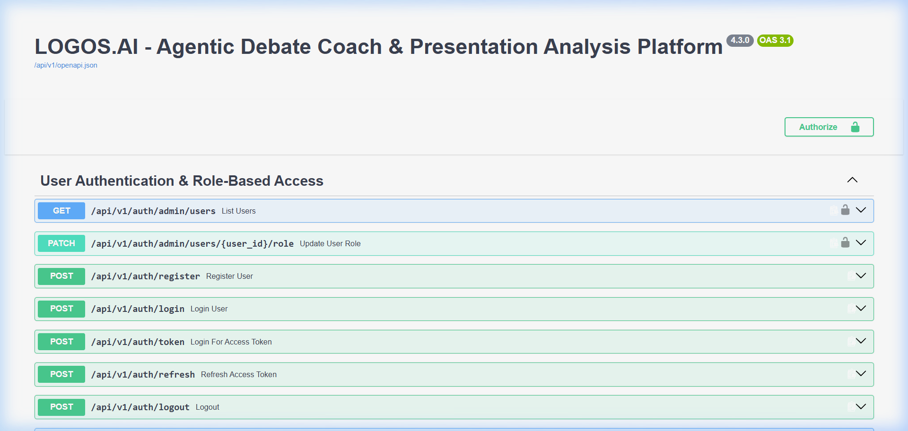

---

## 🌟 Core Architectural Features

1. **Deterministic Local AI Engine (100% Offline Capable)**:
   - Built-in heuristic pattern matching and NumPy vector embeddings.
   - **Zero external API keys required** to run all analysis and simulation features.
   - Optional plug-and-play adapter for OpenAI-compatible LLMs, Groq, and Google Gemini.
2. **Logic Audit (8 Fallacy Types)**:
   - *Ad Hominem*, *Straw Man*, *False Dilemma*, *Slippery Slope*, *Appeal to Authority*, *Circular Reasoning*, *Hasty Generalization*, and *Red Herring*.
3. **Multi-Perspective Rebuttal Generation (5 Types)**:
   - *Logical*, *Evidence-Based*, *Ethical*, *Practical*, and *Policy* rebuttals.
4. **Weighted Scoring Model**:
   $$\text{Score} = (0.30 \times \text{Arg Quality}) + (0.20 \times \text{Evidence}) + (0.20 \times \text{Consistency}) + (0.15 \times \text{Rebuttal}) + (0.15 \times \text{Communication})$$
5. **Speech & Prosody Engine**:
   - Analyzes speaking cadence, silence ratio, volume, pauses, and filler word density.
6. **Dual Database Support**:
   - SQLite for effortless local development with automatic fallback.
   - PostgreSQL + MongoDB for production deployments.

---

## 🛠️ Technology Stack

| Layer | Technologies |
|---|---|
| **Frontend** | Next.js 14 (App Router), React 18, Vanilla CSS Design System, Lucide Icons |
| **Backend** | FastAPI, Pydantic v2, SQLAlchemy 2.0, Uvicorn, WebSockets |
| **Databases** | SQLite (Default / Local), PostgreSQL (Production), MongoDB (Transcripts) |
| **AI / ML** | Heuristic Semantic Hashing Engine, FAISS Vector Search, Optional LLM Adapters (Groq / Gemini / OpenAI) |
| **Audio Processing** | FFmpeg, Soundfile, Librosa (Optional Audio Processing) |
| **Reports** | ReportLab (PDF generation), OpenPyXL (Excel workbooks) |

---

## 🚀 Quick Start: Running Locally

### Prerequisites
* **Python 3.10+** (`python --version`)
* **Node.js 18+** & **npm** (`node --version`)
* **Git**

---

### Step 1: Backend Setup

1. Open your terminal in the project root:
   ```powershell
   # Create and activate virtual environment
   python -m venv .venv
   
   # Windows:
   .venv\Scripts\Activate.ps1
   # macOS / Linux:
   source .venv/bin/activate

   # Install dependencies
   python -m pip install --upgrade pip
   python -m pip install -r backend/requirements.txt
   ```

2. Configure environment:
   ```powershell
   # Copy template (defaults work 100% offline out-of-the-box)
   cp backend/.env.example backend/.env
   ```

3. Launch backend server:
   ```powershell
   python -m uvicorn main:app --app-dir backend --host 127.0.0.1 --port 8000 --reload
   ```
   * Backend Health: `http://localhost:8000/health`
   * Swagger API Docs: `http://localhost:8000/docs`

---

### Step 2: Frontend Setup

1. Open a **new terminal window** in the project root:
   ```powershell
   cd frontend
   npm install
   npm run dev
   ```
2. Open your browser and navigate to:
   **`http://localhost:3000`**

---

### Step 3: Inspect Database Data (CLI Viewer)

We provide a built-in database inspection utility to view all 18 tables and records directly from your terminal:

```powershell
# List all tables, row counts, and columns
python backend/view_db.py

# View specific table data
python backend/view_db.py users
python backend/view_db.py debate_sessions
python backend/view_db.py simulation_turns
python backend/view_db.py presentation_metrics
python backend/view_db.py fallacy_logs

# Dump entire database summary
python backend/view_db.py all
```

---

## 📁 Repository Structure

```
Agentic-AI-Debate-Coach-Presentation-Analysis-Platform/
├── backend/
│   ├── routers/                # 14 Microservice REST API Endpoints
│   │   ├── argument_analysis.py
│   │   ├── auth.py
│   │   ├── coaching.py
│   │   ├── dashboards.py
│   │   ├── fallacy_detection.py
│   │   ├── presentation_analysis.py
│   │   ├── reports.py
│   │   ├── simulation.py
│   │   └── ...
│   ├── services/               # Core AI, Speech & Security Engines
│   │   ├── ai_engine.py
│   │   ├── security.py
│   │   └── speech_engine.py
│   ├── config.py               # Settings & Pydantic env validation
│   ├── database.py             # SQLite/PostgreSQL/MongoDB engine
│   ├── main.py                 # FastAPI Application entrypoint
│   ├── models.py               # SQLAlchemy ORM database models
│   ├── schemas.py              # Pydantic request/response schemas
│   ├── view_db.py              # Built-in database CLI inspection tool
│   └── requirements.txt        # Python backend dependencies
├── frontend/
│   ├── src/
│   │   ├── app/                # Next.js App Router pages
│   │   │   ├── dashboard/      # Role-based analytics dashboards
│   │   │   ├── login/          # User login
│   │   │   ├── notifications/  # Alert stream
│   │   │   ├── presentation/   # Vocal metrics suite
│   │   │   ├── reports/        # PDF/XLSX export & verification
│   │   │   ├── signup/         # Account registration
│   │   │   ├── simulation/     # AI debate terminal
│   │   │   ├── layout.js       # Global layout & single navbar
│   │   │   └── page.js         # Landing page
│   │   ├── components/         # Reusable React components
│   │   └── lib/api.js          # Unified API client
│   └── package.json
├── ai-ml/                      # Standalone AI/ML subservice
│   ├── app/                    # Multi-provider LLM routing (Groq/Gemini/Local)
│   └── tests/                  # Offline AI test suite
├── docs/
│   └── screenshots/            # High-resolution UI & output captures
├── docker-compose.yml          # Container orchestration configuration
├── Dockerfile.backend          # Backend container specification
├── Dockerfile.frontend         # Frontend container specification
└── README.md
```

---

## 🧪 Testing & Validation

Run comprehensive unit and integration tests across backend and AI layers:

```powershell
# 1. Backend unit tests
python -m pytest backend/test_ai_backend.py

# 2. Standalone AI/ML offline verification
python -m pytest ai-ml/tests/test_offline.py

# 3. Live API smoke tests (with backend running)
$env:RUN_LIVE_API_TESTS="1"
python -m pytest backend/test_api.py
```

---

## 📄 License
This project is licensed under the **MIT License** - see the [LICENSE](LICENSE) file for details.
