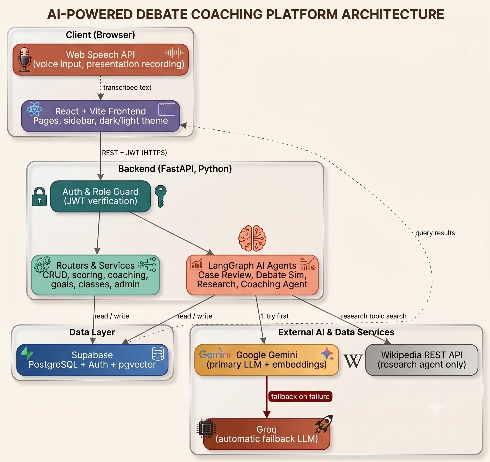
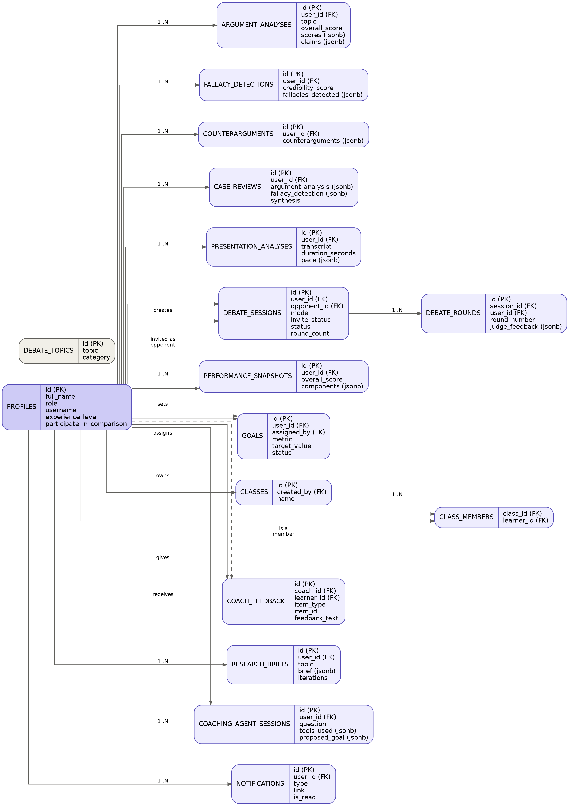

# ClashLab

**AI-powered debate coaching and presentation analysis platform.**

A full-stack application combining conventional coaching tools with
four genuinely distinct AI agent architectures — a fixed pipeline, a
multi-agent debate simulator, a self-directed research loop, and a
tool-calling coaching agent — built entirely on free-tier
infrastructure.

---

## Architecture



React talks to a FastAPI backend over authenticated REST calls; the
backend reads/writes Supabase (PostgreSQL, Auth, pgvector) and calls
out to Google Gemini, with automatic fallback to Groq if Gemini fails.

## Database schema



---

## What it does

- **Argument Analysis, Fallacy Detection, Counterarguments, Full Case
  Review** — submit an argument, get a structured, scored breakdown.
- **AI Debate Simulation** — a multi-agent LangGraph graph with a
  distinct Opponent and Judge, scored round by round.
- **Human-vs-Human Debate Mode** — invite a real person by username to
  a turn-based debate, judged automatically by the same AI once both
  sides have argued.
- **Presentation Analysis** — pace, filler words, and delivery scoring
  from a live recording or pasted transcript.
- **Coaching Plan** — retrieval-augmented (RAG) recommendations
  grounded in a real coaching knowledge base.
- **Ask Your Coach** — a genuine tool-calling agent that decides for
  itself which of 4 tools it needs to answer a question.
- **Debate Prep Research Assistant** — a ReAct-style agent that
  decides for itself how many times to search before answering.
- **Voice input** everywhere text can be typed, via the browser's
  native Web Speech API.
- **Dashboards for every role** — Learner, Debate Coach, Educator,
  Admin — plus classes/cohorts, goals, peer comparison, practice
  streaks, a topic library, and full data export.

Full detail on every module: [`docs/ClashLab_Project_Report.docx`](docs/ClashLab_Project_Report.docx).

## Tech stack

| Layer | Stack |
|---|---|
| Frontend | React 18, Vite, Tailwind CSS, React Router, Recharts |
| Backend | Python, FastAPI, LangGraph |
| Database | Supabase (PostgreSQL, Auth, pgvector) |
| AI | Google Gemini (primary), Groq (automatic fallback) |
| Speech | Browser Web Speech API |

Full reasoning behind every choice (and every substitution made to
stay zero-budget) is in the Project Report above.

## Getting started

```bash
# Backend
cd backend
python -m venv .venv
.venv\Scripts\activate        # Windows
pip install -r requirements.txt
# copy .env.example to .env and fill in your keys
uvicorn app.main:app --reload

# Frontend
cd frontend
npm install
npm run dev
```

Full setup steps: [`SETUP.md`](SETUP.md).

## Testing

- **Manual test plan** with concrete sample inputs per module per
  role: [`TEST_PLAN.md`](TEST_PLAN.md)
- **Automated API smoke test** (~54 checks across every role and
  module, including full role-gating verification):
  ```bash
  python backend/scripts/api_smoke_test.py
  ```
- **Seed data** for a fully populated dev environment (every role,
  every feature, human-vs-human debates in every state):
  ```bash
  python backend/scripts/seed_dummy_data.py
  ```

## Deployment

Deployed on free tiers: Render (backend) + Vercel (frontend). Full
walkthrough: [`DEPLOYMENT_GUIDE.md`](DEPLOYMENT_GUIDE.md).

## Documentation

| Document | What it's for |
|---|---|
| [`docs/ClashLab_Project_Report.docx`](docs/ClashLab_Project_Report.docx) | Full project write-up: every module, the full stack, every AI pattern, every design decision |
| [`docs/ClashLab_Backend_API_Reference.docx`](docs/ClashLab_Backend_API_Reference.docx) | Every endpoint, request/response shape, and AI agent's internals — enough to build a new frontend against this backend without reading its source |
| [`PROJECT_PLAN.md`](PROJECT_PLAN.md) | Full build history, segment by segment |
| [`TEST_PLAN.md`](TEST_PLAN.md) | Manual test plan with sample data |

## Project structure

```
debate-coach-platform/
├── backend/          FastAPI app, services, AI agents, scripts
├── frontend/         React + Vite app
├── docs/             Reports, diagrams
├── PROJECT_PLAN.md
├── TEST_PLAN.md
├── SETUP.md
├── DEPLOYMENT_GUIDE.md
└── render.yaml
```

## License

Built as a learning project. Not currently licensed for reuse.
